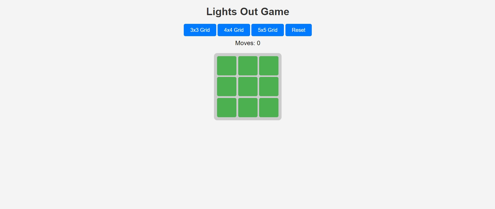
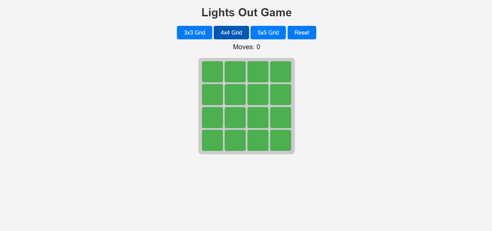
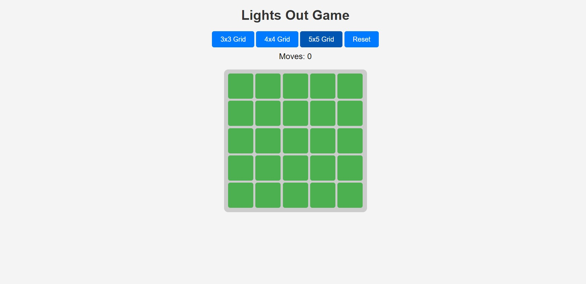

# Lights Out Game 🎮

A simple yet fun **Lights Out Game** built using HTML, CSS, JavaScript, and jQuery. The goal is to turn off all the lights on the grid. Clicking on a cell toggles that cell and its immediate neighbors. The challenge lies in achieving this with the minimum number of moves.

Forked from **https://github.com/paul-srijan/Lights-Out-Game**

---
## New Features
- **Hint Button**: Shows you the next step to solve the grid
- **Custom Grid Input**: Lets you put in your own grid and visually see the solution
---

## Features
- **Dynamic Grid Sizes**: Choose between **3x3**, **4x4**, or **5x5** grids.
- **Toggle Mechanism**: Clicking a button toggles its state and that of its immediate neighbors.
- **Win Condition**: Alerts when all the lights are turned off.
- **Move Counter**: Tracks the number of moves taken to solve the puzzle.
- **Reset Button**: Restart the game with the current grid size.

---

## How to Play
1. Select a grid size (**3x3**, **4x4**, or **5x5**).
2. Click on Set Grid or Random Grid.
3. Click on the Grids to toggle them on and off
4. Aim to turn off all the lights (buttons turn black).
5. Track your progress with the move counter.
6. Use the **Reset** button to restart.

---

## Getting Started

### Prerequisites
Make sure you have the following installed:
- A web browser (Chrome, Firefox, Brave etc.)
- Basic text editor or IDE (e.g., Notepad / VS Code)


### Installation-Zip
1. Download Zip File

2. Open the file in your File explored and right click on it

3. Select Extract Here

4. Open the newly created folder called "Lights-Out-Game"

5. Double Click index.html and it should open in your browser

---

### Installation-Git
1. Clone this repository:
   ```bash
   git clone https://github.com/your-username/lights-out-game.git
   ```
2. Navigate to the project directory:
   ```bash
   cd lights-out-game
   ```
3. Open `index.html` in your browser to play the game!


---

## Screenshots

### 3x3 Grid


### 4x4 Grid


### 5x5 Grid


---

## Original Author

**Srijan Paul**  
[GitHub Profile](https://github.com/paul-srijan)
